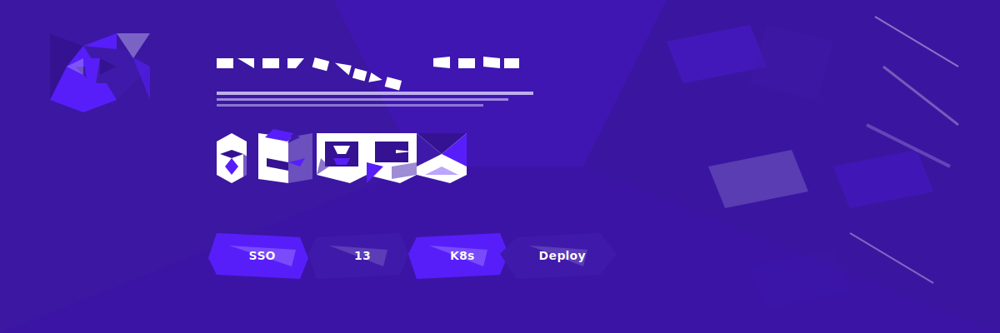

<!--
SPDX-FileCopyrightText: 2024 Zentrum für Digitale Souveränität der öffentlichen Verwaltung (ZenDiS) GmbH
SPDX-FileCopyrightText: 2024 Bundesministerium des Innern und für Heimat, PG ZenDiS "Projektgruppe für Aufbau ZenDiS"
SPDX-License-Identifier: Apache-2.0
-->

<div align="center">

### TL;DR 🚀
openDesk CE + 13 education services (ILIAS, Moodle, BigBlueButton, OpenCloud, …)<br/>
one-command Kubernetes deploy with unified Keycloak SSO

# 🎓 openDesk Edu

**openDesk + Educational Services for Universities**



[](https://opensource.org/licenses/Apache-2.0)
[](https://kubernetes.io)
[](https://helm.sh)
[](https://www.opencode.de/en/opendesk)

<br/>

[📖 ILIAS](https://www.ilias.de/) &nbsp;·&nbsp;
[📚 Moodle](https://moodle.org/) &nbsp;·&nbsp;
[🎥 BigBlueButton](https://bigbluebutton.org/) &nbsp;·&nbsp;
[☁️ OpenCloud](https://opencloud.eu/) &nbsp;·&nbsp;
[🔐 Keycloak SSO](https://www.keycloak.org/)

<br/>

An extension of [openDesk Community Edition](https://www.opencode.de/en/opendesk) that adds
**learning management systems** (ILIAS, Moodle) and provides **alternative components** for
video conferencing (BigBlueButton ↔ Jitsi) and file sharing (OpenCloud ↔ Nextcloud) —
all integrated with openDesk's existing Keycloak SSO and portal. Deploy everything on Kubernetes with a single `helmfile apply`.

[Getting Started →](#-quick-start) &nbsp;·&nbsp; [What's Added →](#-whats-added-on-top-of-opendesk-ce) &nbsp;·&nbsp; [Roadmap →](./ROADMAP.md) &nbsp;·&nbsp; [All Components →](#-full-component-matrix)

<br/>

**🎤 Presentations available in 28 languages** — [see all →](./docs/presentations/linuxtag-2026/README-presentation.md)

| Language | Source | HTML |
|:---------|:-------|:-----|
| 🇩🇪 Deutsch | [Markdown](./docs/presentations/linuxtag-2026/linuxtag-2026-opendesk.md) | [▶ View](https://htmlpreview.github.io/?https://github.com/tobias-weiss-ai-xr/opendesk-edu/blob/main/docs/presentations/linuxtag-2026/linuxtag-2026-opendesk.html) |
| 🇬🇧 English | [Markdown](./docs/presentations/linuxtag-2026/linuxtag-2026-opendesk-en.md) | [▶ View](https://htmlpreview.github.io/?https://github.com/tobias-weiss-ai-xr/opendesk-edu/blob/main/docs/presentations/linuxtag-2026/linuxtag-2026-opendesk-en.html) |
| 🇫🇷 Français | [Markdown](./docs/presentations/linuxtag-2026/linuxtag-2026-opendesk-fr.md) | [▶ View](https://htmlpreview.github.io/?https://github.com/tobias-weiss-ai-xr/opendesk-edu/blob/main/docs/presentations/linuxtag-2026/linuxtag-2026-opendesk-fr.html) |
| 🇪🇸 Español | [Markdown](./docs/presentations/linuxtag-2026/linuxtag-2026-opendesk-es.md) | [▶ View](https://htmlpreview.github.io/?https://github.com/tobias-weiss-ai-xr/opendesk-edu/blob/main/docs/presentations/linuxtag-2026/linuxtag-2026-opendesk-es.html) |
| 🇨🇳 中文 | [Markdown](./docs/presentations/linuxtag-2026/linuxtag-2026-opendesk-zh.md) | [▶ View](https://htmlpreview.github.io/?https://github.com/tobias-weiss-ai-xr/opendesk-edu/blob/main/docs/presentations/linuxtag-2026/linuxtag-2026-opendesk-zh.html) |

</div>

---

## 🚀 Quick Start

```bash
# ✅ ONE COMMAND to deploy openDesk + all educational services
helmfile -e default apply
```

📖 **Prerequisites & Setup Guide:**
- Kubernetes 1.28+, Helm 3, [helmfile](https://helmfile.readthedocs.io/)
- Edit config: `helmfile/environments/default/global.yaml.gotmpl`
- [Detailed guide →](./docs/getting-started.md)  |  [Requirements →](./docs/requirements.md)

---

## 📚 What is openDesk Edu?

openDesk Edu takes the stock [openDesk CE](https://www.opencode.de/en/opendesk) deployment and adds the
core services universities need — all integrated with openDesk's existing Keycloak-based SSO and portal.

### Educational Services Added ➕

| Service | Component | Status | Description |
|:--------|:----------|:------:|:------------|
| 📖 **Learning Management** | [ILIAS](https://www.ilias.de/) | 🔄 Beta | Full-featured LMS with SAML SSO — courses, assessments, forums, SCORM |
| 📖 **Learning Management** | [Moodle](https://moodle.org/) | 🔄 Beta | Plugin-rich LMS — assignments, workshops, gradebook, Shibboleth auth |

### Additional education tools 🎓

| Service | Component | Status | Description |
|:--------|:----------|:------:|:------------|
| 📝 **Collaborative Editing** | [Etherpad](https://etherpad.org/) | 🔄 Beta | Real-time collaborative document editor — meeting notes, workshops, live editing |
| 📚 **Knowledge Base** | [BookStack](https://www.bookstackapp.com/) | 🔄 Beta | Wiki with book/chapter structure — course materials, SOPs, documentation |
| 📋 **Project Management** | [Planka](https://planka.app/) | 🔄 Beta | Kanban boards with OIDC — student projects, research planning |
| 🎫 **Service Desk** | [Zammad](https://zammad.com/) | 🔄 Beta | Helpdesk with SAML — IT support, multi-channel (email, chat, phone) |
| 📊 **Surveys** | [LimeSurvey](https://www.limesurvey.org/) | 🔄 Beta | Survey platform — course evaluations, academic research |
| 🔑 **Password Self-Service** | [LTB SSP](https://ltb-project.org/) | 🔄 Beta | LDAP password reset — reduces helpdesk tickets |
| 📐 **Diagramming** | [Draw.io](https://www.drawio.com/) | 🔄 Beta | Architecture diagrams, flowcharts, UML — export to PDF/VSDX |
| ✏️ **Whiteboarding** | [Excalidraw](https://excalidraw.com/) | 🔄 Beta | Hand-drawn sketches, brainstorming — lightweight and fast |

### Alt Components (Choose One) 🔄

Configure **either** the standard openDesk CE component **or** its education-focused alternative — not both.

| Standard | Alternative | Status | Key Benefits |
|:---------|:------------|:------:|:-------------|
| 📧 [OX App Suite](https://www.open-xchange.com/) | [SOGo](https://www.sogo.nu/) | 🔄 Beta | Email-focused, modern UI, better student experience, tight LDAP integration |
| 📹 [Jitsi](https://jitsi.github.io/) | [BigBlueButton](https://bigbluebutton.org/) | 🔄 Beta | Built for teaching: recording, whiteboard, breakout rooms, session timers |
| 📁 [Nextcloud](https://nextcloud.com/) | [OpenCloud](https://opencloud.eu/) | 🔄 Beta | Lightweight for education: per-course shares, CS3-based sync |

## ✨ How It Works

- 🔐 **SSO** – One login (Keycloak) via SAML2/OIDC for all services
- 🖥️ **Unified Portal** – Access educational services alongside openDesk apps
- 📦 **Modular Charts** – Each service in its own configurable Helm chart
- 💾 **Integrated Backups** – k8up-backed persistent data (LMS, recordings, files)

### What's unchanged ✅

All core openDesk CE components remain intact — Element, Nextcloud, Open-Xchange, XWiki, OpenProject,
Jitsi, CryptPad, Notes, Collabora, and the full Nubus IAM stack. BBB and OpenCloud are optional
drop-in alternatives, not replacements. This is a **superset** of openDesk CE, not a fork.

---

## 🏢 Full Component Matrix

> The complete openDesk suite including all educational extensions.

| 🏷️ Function | 📦 Component | 📜 License | 📌 Version | 📖 Docs |
|:-------------|:-------------|:-----------|:-----------|:--------|
| 💬 Chat | Element ft. Nordeck widgets | AGPL-3.0 / Apache-2.0 | [1.12.6](https://github.com/element-hq/element-web/releases/tag/v1.12.6) | [Docs](https://element.io/user-guide) |
| 📝 Notes | Notes (aka Docs) | MIT | [4.4.0](https://github.com/suitenumerique/docs/releases/tag/v4.4.0) | In-app |
| 📊 Diagrams | CryptPad ft. diagrams.net | AGPL-3.0 | [2025.9.0](https://github.com/cryptpad/cryptpad/releases/tag/2025.9.0) | [Docs](https://docs.cryptpad.org/en/) |
| 📁 Files | Nextcloud | AGPL-3.0 | [32.0.6](https://nextcloud.com/de/changelog/#32-0-6) | [Docs](https://docs.nextcloud.com/) |
| 📧 **Groupware** | **OX App Suite** | GPL-2.0 / AGPL-3.0 | [8.46](https://documentation.open-xchange.com/appsuite/releases/8.46/) | [Docs](https://documentation.open-xchange.com/) |
| 💌 **Alt Webmail** | **SOGo** (↔ OX App Suite) | LGPL-2.1 | [5.11](https://github.com/Alinto/sogo/releases) | [Docs](https://www.sogo.nu/support/documentation.html) |
| 📚 Wiki | XWiki | LGPL-2.1 | [17.10.4](https://www.xwiki.org/xwiki/bin/view/ReleaseNotes/Data/XWiki/17.10.4/) | [Docs](https://www.xwiki.org/xwiki/bin/view/Documentation) |
| 🔑 Portal & IAM | Nubus | AGPL-3.0 | [1.18.1](https://docs.software-univention.de/nubus-kubernetes-release-notes/1.x/en/1.18.html) | [Docs](https://docs.software-univention.de/n/en/nubus.html) |
| 📋 Projects | OpenProject | GPL-3.0 | [17.2.1](https://www.openproject.org/docs/release-notes/17-2-1/) | [Docs](https://www.openproject.org/docs/user-guide/) |
| 📹 Meetings | Jitsi | Apache-2.0 | [2.0.10590](https://github.com/jitsi/jitsi-meet/releases/tag/stable%2Fjitsi-meet_10590) | [Docs](https://jitsi.github.io/handbook/docs/category/user-guide/) |
| 📄 Office | Collabora | MPL-2.0 | [25.04.8](https://www.collaboraoffice.com/code-25-04-release-notes/) | [Docs](https://sdk.collaboraonline.com/) |
| 📖 **LMS** | **ILIAS** | GPL-3.0 | [7.28](https://github.com/ILIAS-eLearning/ILIAS/releases) | [Docs](https://docu.ilias.de/) |
| 📖 **LMS** | **Moodle** | GPL-3.0 | [4.4](https://moodle.org/release/) | [Docs](https://docs.moodle.org/) |
| 🎥 **Lectures** | **BigBlueButton** (↔ Jitsi) | LGPL-3.0 | [2.7](https://github.com/bigbluebutton/bigbluebutton/releases) | [Docs](https://docs.bigbluebutton.org/) |
| ☁️ **Files** | **OpenCloud** (↔ Nextcloud) | Apache-2.0 | [4.0.3](https://github.com/opencloudeu/opencloud/releases) | [Docs](https://docs.opencloud.eu/) |
| 📝 **Collab Editing** | **Etherpad** | Apache-2.0 | [1.9.9](https://github.com/ether/etherpad-lite/releases) | [Docs](https://etherpad.org/doc/) |
| 📚 **Wiki** | **BookStack** | MIT | [26.03](https://github.com/BookStackApp/BookStack/releases) | [Docs](https://www.bookstackapp.com/docs/) |
| 📋 **Kanban** | **Planka** | AGPL-3.0 | [2.1.0](https://github.com/plankanban/planka/releases) | [Docs](https://docs.planka.app/) |
| 🎫 **Helpdesk** | **Zammad** | AGPL-3.0 | [7.0](https://github.com/zammad/zammad/releases) | [Docs](https://docs.zammad.com/) |
| 📊 **Surveys** | **LimeSurvey** | GPL-2.0 | [6.6](https://github.com/LimeSurvey/LimeSurvey/releases) | [Docs](https://www.limesurvey.org/manual/) |
| 🔑 **Password Reset** | **LTB SSP** | GPL-3.0 | [1.7](https://github.com/ltb-project/self-service-password/releases) | [Docs](https://self-service-password.readthedocs.io/) |
| 📐 **Diagrams** | **Draw.io** | Apache-2.0 | [29.6](https://github.com/jgraph/drawio/releases) | [Docs](https://www.drawio.com/doc/) |
| ✏️ **Whiteboard** | **Excalidraw** | MIT | [latest](https://github.com/excalidraw/excalidraw/releases) | [Docs](https://docs.excalidraw.com/) |

---

## 📖 Documentation

| Topic | Link |
|:------|:-----|
| ⬆️ Upgrades & Migrations | [docs/migrations.md](./docs/migrations.md) |
| 📋 Requirements | [docs/requirements.md](./docs/requirements.md) |
| 🚀 Getting Started | [docs/getting-started.md](./docs/getting-started.md) |
| 🔧 Advanced Customization | [docs/enhanced-configuration.md](./docs/enhanced-configuration.md) |
| 🔌 External Services (edu) | [docs/external-services.md](./docs/external-services.md) |
| 🏗️ Architecture | [docs/architecture.md](./docs/architecture.md) |
| 🔐 Security | [docs/security.md](./docs/security.md) |
| 📊 Scaling | [docs/scaling.md](./docs/scaling.md) |
| 📈 Monitoring | [docs/monitoring.md](./docs/monitoring.md) |
| 🎨 Theming | [docs/theming.md](./docs/theming.md) |
| 🔑 Permissions | [docs/permissions.md](./docs/permissions.md) |
| 💾 Data Storage | [docs/data-storage.md](./docs/data-storage.md) |
| 🧪 Testing | [docs/testing.md](./docs/testing.md) |

---

## 🎤 Presentations

> Available in **28 languages** — [see the full list](./docs/presentations/linuxtag-2026/README-presentation.md)

| Event | Language | Source | HTML |
|:------|:--------|:-------|:-----:|
| CLT 2026 | 🇩🇪 Deutsch | [Markdown](./docs/presentations/linuxtag-2026/linuxtag-2026-opendesk.md) | [▶ View](https://htmlpreview.github.io/?https://github.com/tobias-weiss-ai-xr/opendesk-edu/blob/main/docs/presentations/linuxtag-2026/linuxtag-2026-opendesk.html) |
| CLT 2026 | 🇬🇧 English | [Markdown](./docs/presentations/linuxtag-2026/linuxtag-2026-opendesk-en.md) | [▶ View](https://htmlpreview.github.io/?https://github.com/tobias-weiss-ai-xr/opendesk-edu/blob/main/docs/presentations/linuxtag-2026/linuxtag-2026-opendesk-en.html) |
| CLT 2026 | 🇫🇷 Français | [Markdown](./docs/presentations/linuxtag-2026/linuxtag-2026-opendesk-fr.md) | [▶ View](https://htmlpreview.github.io/?https://github.com/tobias-weiss-ai-xr/opendesk-edu/blob/main/docs/presentations/linuxtag-2026/linuxtag-2026-opendesk-fr.html) |
| CLT 2026 | 🇪🇸 Español | [Markdown](./docs/presentations/linuxtag-2026/linuxtag-2026-opendesk-es.md) | [▶ View](https://htmlpreview.github.io/?https://github.com/tobias-weiss-ai-xr/opendesk-edu/blob/main/docs/presentations/linuxtag-2026/linuxtag-2026-opendesk-es.html) |
| CLT 2026 | 🇨🇳 中文 | [Markdown](./docs/presentations/linuxtag-2026/linuxtag-2026-opendesk-zh.md) | [▶ View](https://htmlpreview.github.io/?https://github.com/tobias-weiss-ai-xr/opendesk-edu/blob/main/docs/presentations/linuxtag-2026/linuxtag-2026-opendesk-zh.html) |

---

## 🛠️ Tech Stack

| Layer | Technology |
|:------|:-----------|
| ☸️ Orchestration | [Kubernetes](https://kubernetes.io) |
| 📦 Package Management | [Helm](https://helm.sh) + [helmfile](https://helmfile.readthedocs.io/) |
| 🔐 Authentication | [Keycloak](https://www.keycloak.org/) (SAML 2.0 + OIDC) |
| 🎓 SAML SP | [Shibboleth](https://www.shibboleth.net/) (ILIAS, Moodle, BBB) |
| 💾 Backup | [k8up](https://k8up.io/) (restic + Kubernetes operator) |
| 🔒 Certificates | [openDesk Certificates](https://github.com/Bundesdruckerei/opendesk-certificates) |

---

## 💬 Feedback & Issues

Found a bug or have a feature request? Please [open an issue](https://github.com/tobias-weiss-ai-xr/opendesk-edu/issues).

## 🤝 Contributing

Contributions are welcome! See the [Development guide](./docs/developer/development.md) for how to get started.

---

## 📄 License

[Apache-2.0](https://opensource.org/licenses/Apache-2.0) — see [LICENSE](./LICENSE) for details.

## ©️ Copyright

openDesk Edu is a fork of [openDesk](https://www.opencode.de/en/opendesk). Upstream copyright:

Copyright (C) 2024-2025 Zentrum für Digitale Souveränität der Öffentlichen Verwaltung (ZenDiS) GmbH

openDesk Edu additions:

Copyright (C) 2025-2026 openDesk Edu Contributors
