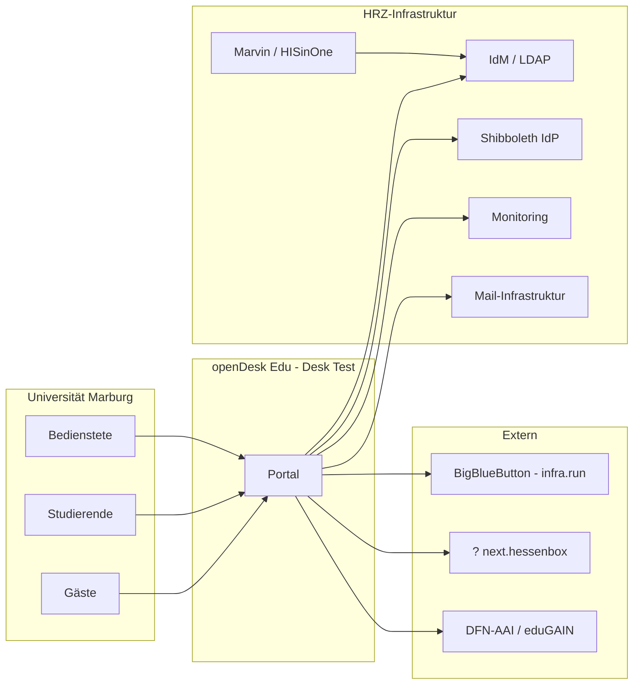
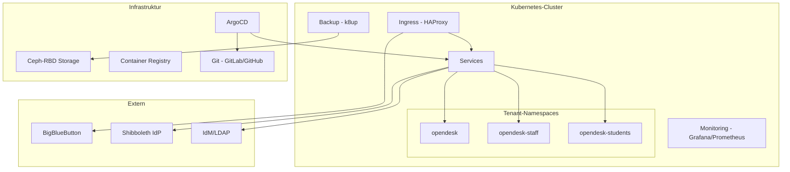
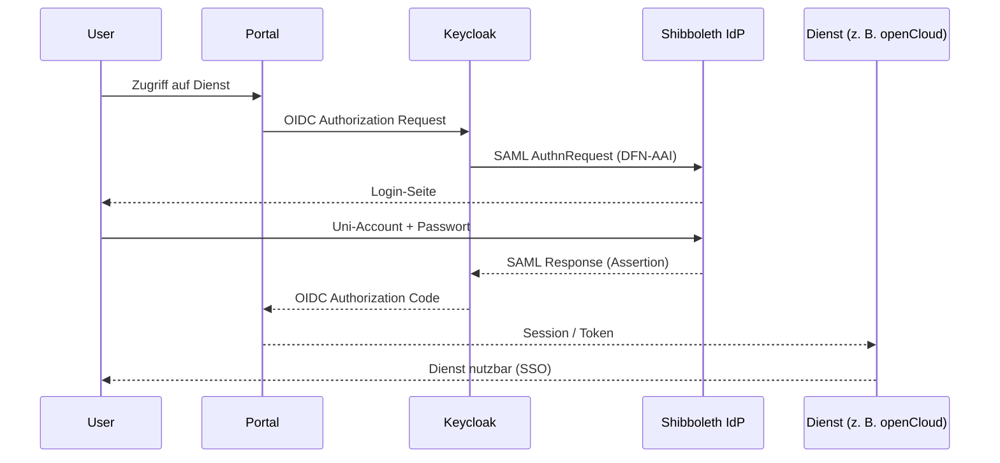
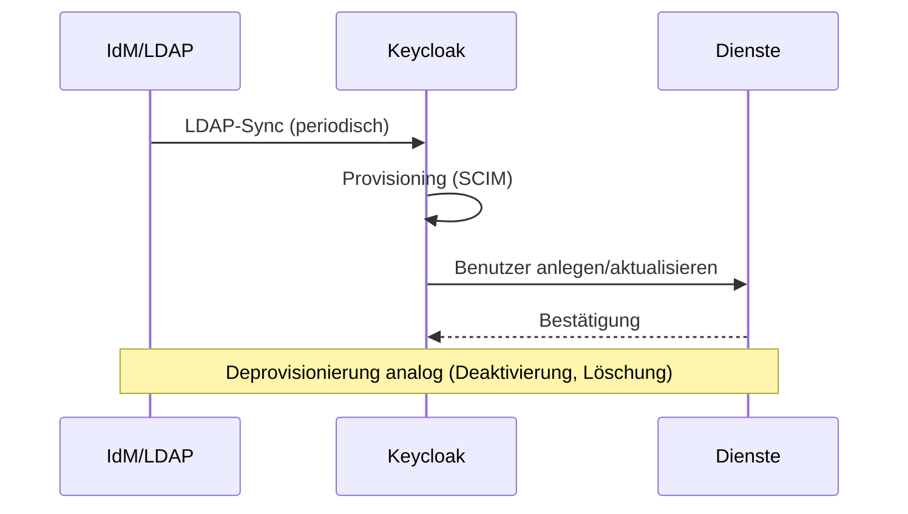
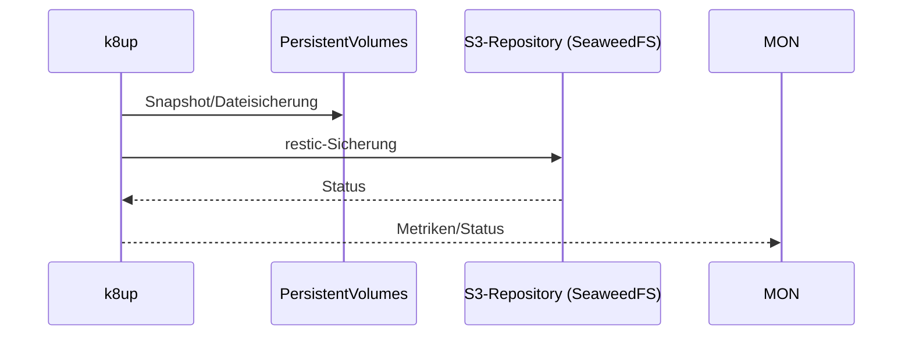

<!--
SPDX-FileCopyrightText: 2026 openDesk Edu Contributors
SPDX-License-Identifier: Apache-2.0
-->

# openDesk Edu – Architekturdokumentation (arc42)

> **Version:** 1.0  
> **Stand:** Juni 2026  
> **Klassifikation:** Intern  
> **Status:** Entwurf (Pilotbetrieb)

Diese Architekturdokumentation folgt dem [arc42-Template](https://arc42.org) (Version 8).
Sie beschreibt die Architektur von **openDesk Edu als Ganzes** – dem digitalen souveränen
Arbeitsplatz für Hochschulen und öffentliche Verwaltung. Die UMR-spezifische Ausprägung
**Desk Test** (desk-test.uni-marburg.de) dient als Referenz-Deployment und ist in den
jeweiligen Abschnitten als solche gekennzeichnet.

---

## Inhaltsverzeichnis

1. [Einführung und Ziele](#1-einführung-und-ziele)
2. [Randbedingungen](#2-randbedingungen)
3. [Kontextabgrenzung](#3-kontextabgrenzung)
4. [Lösungsstrategie](#4-lösungsstrategie)
5. [Bausteinsicht](#5-bausteinsicht)
6. [Laufzeitsicht](#6-laufzeitsicht)
7. [Verteilungssicht](#7-verteilungssicht)
8. [Querschnittliche Konzepte](#8-querschnittliche-konzepte)
9. [Architekturentscheidungen](#9-architekturentscheidungen)
10. [Qualitätsanforderungen](#10-qualitätsanforderungen)
11. [Risiken und technische Schulden](#11-risiken-und-technische-schulden)
12. [Glossar](#12-glossar)

---

# 1. Einführung und Ziele

## 1.1 Aufgabenstellung

openDesk Edu stellt einen **digitalen souveränen Arbeitsplatz** für Lehre, Forschung und
Verwaltung bereit. Er bündelt Datei-, Kommunikations- und Kollaborationsfunktionen in einer
gemeinsamen, betreiberunabhängigen Umgebung.

Die Plattform basiert auf der openDesk-Referenzimplementierung (ZenDiS) und wird durch eine
Edu-spezifische Erweiterung um Hochschulbedarfe ergänzt (Identity Management, mehrere
Tenants, Integration bestehender Hochschulsysteme).

## 1.2 Qualitätsziele

| Rang | Qualitätsziel | Erläuterung |
|------|---------------|-------------|
| 1 | **Digitale Souveränität** | Vollständige Datenhoheit beim Betreiber, Open Source, keine Anbieterbindung |
| 2 | **Betreiberunabhängigkeit** | Reproduzierbare Deployments bei beliebigen Betreibern |
| 3 | **Datenschutzkonformität** | DSGVO-konformer Betrieb, on-premises Option |
| 4 | **Skalierbarkeit** | Von Pilot (Dutzende) bis Vollbetrieb (Zehntausende Nutzer) |
| 5 | **Interoperabilität** | Integration in bestehende Hochschul-IT (IdM, Shibboleth, LDAP) |

## 1.3 Stakeholder

| Rolle | Erwartungen |
|-------|-------------|
| **Nutzer** (Bedienstete, Studierende, Gäste) | Intuitive Bedienung, zuverlässige Dienste |
| **Service Owner** (z. B. HRZ-Abteilungsleitung) | Betriebsfähigkeit, Kostenkontrolle, Konformität |
| **Service Manager** | Betriebs- und Supportaufwand planbar |
| **IT-Administratoren** | Wartbarkeit, Monitoring, Backup/DR |
| **Datenschutzbeauftragter** | DSGVO-Konformität, Datenlöschkonzepte |
| **openDesk Community / ZenDiS** | Rückmeldung für Referenzimplementierung |

---

# 2. Randbedingungen

## 2.1 Technische Randbedingungen

| Randbedingung | Erläuterung |
|---------------|-------------|
| Kubernetes | Plattform als Kubernetes-Deployment |
| Helmfile / Helm | Orchestrierung aller Charts |
| GitOps (ArgoCD) | Automatisierte Synchronisation aus Git |
| Open Source | Keine proprietären Kernkomponenten |
| Container-Registry | Images aus eigener Registry / öffentlichen Quellen |

## 2.2 Organisatorische Randbedingungen

| Randbedingung | Erläuterung |
|---------------|-------------|
| IT-Betreiber | HRZ der jeweiligen Einrichtung (UMR für Desk Test) |
| Pilotphasen | Stufenweise Erprobung (IT → Verwaltung → Fachbereiche) |
| Kein Produktivbetrieb | Desk Test ist eine Testumgebung (Pilot) |

## 2.3 Konventionen

- Container-Images: Versionierung mit konkreten Tags (kein `latest` im Produktivbetrieb)
- Manifeste: YAML mit SPDX-Header und Apache-2.0-Lizenz
- Secrets: niemals in Git, via Kubernetes Secrets / External Secrets
- Dokumentation: arc42 für Architektur, Markdown für Betriebsdokumente

---

# 3. Kontextabgrenzung

## 3.1 Fachlicher Kontext



## 3.2 Technischer Kontext

| System | Schnittstelle | Protokoll | Zweck |
|--------|---------------|-----------|-------|
| **Marvin / HISinOne** | Quelle für Identität, Rollen, Studienstatus | (über Uni-IdM) / Webhook | Nutzer-Lifecycle, Semester |
| **IdM / LDAP** | User-Provisionierung | LDAP / REST (SCIM) | Nutzer-Lifecycle |
| **Shibboleth IdP** | Authentifizierung | SAML 2.0 | SSO über DFN-AAI |
| **Keycloak** | Token-Ausstellung | OIDC | SSO für alle Dienste |
| **BigBlueButton** (extern) | Videokonferenzen | BBB API (SHA1-HMAC) | Meetings |
| **next.hessenbox** | Dateiablage (optional) | WebDAV / OIDC | Sync&Share |
| **Mail-Infrastruktur** | SMTP/IMAP | SMTP, IMAPS | E-Mail-Versand/-Empfang |
| **Monitoring** | Metriken | Prometheus | Betriebsüberwachung |

---

# 4. Lösungsstrategie

Die Lösungsstrategie von openDesk Edu basiert auf drei Säulen:

1. **Kubernetes-native Plattform**
   - Alle Dienste als Container in einem Kubernetes-Cluster
   - Stabiler Kern (Helm Charts), reproduzierbare Konfiguration (Helmfile + Nix)

2. **Zentrales Identity Management**
   - Keycloak als Single Point of Authentication
   - Shibboleth-Integration für DFN-AAI/eduGAIN
   - Automatisierte Provisionierung aus bestehendem IdM

3. **Modulärer Dienste-Stack**
   - Jeder Dienst ist eine eigenständige Komponente
   - Dienste können einzeln skaliert, ausgetauscht oder abgeschaltet werden
   - Externe Dienste (z. B. BigBlueButton) werden bewusst ausgelagert, wenn
     die on-premises Bereitstellung nicht möglich ist (IPv6-Problematik)

**UMR-spezifisch:** Bereitstellung auf **Bare-Metal k3s**, **SCS-konform (Sovereign Cloud Stack,
SCS-compatible KaaS SCS-0502) und zertifizierbar**, als Testumgebung (Desk Test) zur Validierung
von Stabilität und Betriebsaufwand vor einem Produktivbetrieb.

---

# 5. Bausteinsicht

## 5.1 Ebene 1: Plattform



## 5.2 Ebene 2: Dienste-Komponenten

| Baustein | Verantwortlichkeit | Kern-Technologie | Ausprägung |
|----------|-------------------|------------------|------------|
| **Portal** | Zentraler Zugang, Dienste-Katalog, File-Picker | openDesk Portal (Node.js) | je Deployment |
| **Keycloak** | Identität, SSO, Token | Keycloak | je Deployment |
| **openCloud** | Dateiablage, Sharing, Kollaboration | Nextcloud | je Deployment |
| **SOGo** | E-Mail, Kalender, Kontakte | SOGo + Dovecot/Postfix | je Tenant |
| **Element/Synapse** | Messenger | Matrix / Synapse | je Deployment |
| **Etherpad** | Kollaboratives Editieren | Etherpad | je Deployment |
| **XWiki** | Wissensmanagement | XWiki (Tomcat) | je Deployment |
| **BigBlueButton** | Videokonferenzen | BBB (extern) | infra.run |
| **Grafana/Prometheus** | Monitoring | Grafana, Prometheus | je Deployment |
| **k8up** | Backup | k8up (restic) | je Deployment |

## 5.3 Ebene 3: Querschnittsbausteine

- **Ingress/TLS:** HAProxy mit automatischer Zertifikatsrotation (Let's Encrypt)
- **Netzwerk:** Multi-Tenant-Namespaces mit NetworkPolicies
- **Secrets:** Kubernetes Secrets pro Namespace
- **Logging:** Zentrales Logging (Promtail/Loki o. ä. je Ausprägung)

---

# 6. Laufzeitsicht

## 6.1 SSO-Login (OIDC)



## 6.2 User-Provisionierung



## 6.3 Backup



---

# 7. Verteilungssicht

## 7.1 Referenz-Deployment (UMR – Desk Test)

| Aspekt | Ausprägung |
|--------|------------|
| **Cluster** | k3s auf Bare-Metal, 3 Nodes, SCS-konform (SCS-0502), zertifizierbar |
| **Storage** | Ceph-RBD, StorageClasses: `ceph-rbd`, `ceph-rbd-staff` |
| **Tenants** | `opendesk`, `opendesk-staff`, `opendesk-students` |
| **Domains** | `desk-test.uni-marburg.de` (Test), `home.opendesk-edu.org` (Produktiv) |
| **Ingress** | HAProxy, TLS via Let's Encrypt |
| **Backup** | k8up → SeaweedFS S3, separate Schedules pro Tenant |
| **Netz** | VPN / HTTPS, Proxy `www-proxy2.uni-marburg.de:3128` |

## 7.2 Deployment-Diagramm

```mermaid
flowchart LR
    subgraph BM[Bare-Metal-Server]
        subgraph K3S[k3s Cluster]
            subgraph N1[Tenant opendesk]
                P1[Portal] KC1[Keycloak] OC1[openCloud] SG1[SOGo] XW1[XWiki] EL1[Element]
            end
            subgraph N2[Tenant opendesk-staff]
                SG2[SOGo] XW2[XWiki]
            end
            MON1[Grafana] BKP1[k8up]
        end
        CEPH1[Ceph-RBD]
    end
    subgraph Extern
        BBB1[BigBlueButton infra.run]
        SH1[Shibboleth IdP UMR]
        S3[SeaweedFS S3]
    end
    K3S --> CEPH1
    N1 --> BBB1
    N1 --> SH1
    BKP1 --> S3
```

## 7.3 Betreiberunabhängigkeit

Die Verteilungssicht ist je Betreiber unterschiedlich. Die Referenzimplementierung
(ZenDiS) liefert ein Standard-Deployment; Betreiber können Cluster-Typ (k3s, RKE, EKS…),
Storage und Netzwerk frei wählen, solange Kubernetes und die Schnittstellen
(Helmfile, ArgoCD, S3) eingehalten werden.

---

# 8. Querschnittliche Konzepte

## 8.1 Authentifizierung & Autorisierung

| Konzept | Umsetzung |
|---------|-----------|
| **SSO** | Keycloak als zentraler IdP, OIDC für alle Dienste |
| **Föderation** | Shibboleth (SAML) für DFN-AAI / eduGAIN |
| **Rollen** | Keycloak-Realm-Rollen, gruppenbasierte Zugriffe |
| **Multi-Tenancy** | Separate Namespaces + Keycloak-Clients pro Tenant |
| **Token** | PKCE (S256), Backchannel-Logout, Refresh-Tokens |

## 8.2 Datenspeicherung

| Daten | Speicher | Backup |
|-------|----------|--------|
| Dateien (openCloud) | PVC (Ceph-RBD) | k8up täglich |
| Mail/Kalender (SOGo) | DB (MariaDB Galera) | k8up täglich |
| Wissensdaten (XWiki) | DB (MariaDB Galera) + PVC | k8up täglich |
| Identität (Keycloak) | DB (PostgreSQL) | k8up täglich |
| Backups | SeaweedFS S3 | Retention 30 Tage |

## 8.3 Sicherheit

- Netzwerksegmentierung pro Tenant (NetworkPolicies)
- TLS für alle externen Zugriffe, Zertifikatsrotation automatisch
- Secrets nie in Git – Kubernetes Secrets / External Secrets
- Regelmäßige Sicherheitsupdates (Patch-Zyklus)
- Minimales Berechtigungsmodell (RBAC), PodSecurity

## 8.4 Betrieb

- **Monitoring:** Grafana + Prometheus + Alertmanager
- **Backup:** k8up mit separaten Schedules/S3-Credentials pro Tenant
- **Deployment:** ArgoCD GitOps, Helmfile, Nix-Manifeste
- **Wartung:** Patch-Tuesday (4-Wochen-Zyklus), Ferienfenster

---

# 9. Architekturentscheidungen

| # | Entscheidung | Alternativen | Begründung | Status |
|---|--------------|--------------|------------|--------|
| 1 | Kubernetes-basiertes Deployment | Docker Compose, VMs | Skalierbarkeit, Community | Umgesetzt |
| 2 | Helmfile + ArgoCD (GitOps) | Terraform, Shell | Reproduzierbarkeit, Audit | Umgesetzt |
| 3 | Keycloak als zentraler IdP | klassisches LDAP direkt | OIDC/SAML, Föderation | Umgesetzt |
| 4 | openCloud (Nextcloud) als Dateiablage | Nextcloud selbst, Seafile | openDesk-Integration | Umgesetzt |
| 5 | SOGo als Groupware | OX App Suite | Open Source, CalDAV/CardDAV | Umgesetzt |
| 6 | BigBlueButton **extern** (infra.run) | BBB on-premises | IPv6-Problematik im Uni-Netz | Umgesetzt |
| 7 | Bare-Metal k3s (bleeding edge) für UMR-Test | SCS/OSISM, RKE | Schnelle Erprobung, geringe Komplexität | Umgesetzt |
| 8 | XWiki für Wissensmanagement | Confluence, MediaWiki | Open Source, OIDC | Umgesetzt |
| 9 | MariaDB Galera als Datenbank | MariaDB single, PostgreSQL | Hochverfügbarkeit, Cluster | Umgesetzt |
| 10 | k8up + SeaweedFS S3 für Backups | Velero, CronJobs | K8s-nativ, Multi-Tenant | Umgesetzt |

Weitere Entscheidungen werden als ADR (Architecture Decision Records) in
`docs/adr/` dokumentiert.

---

# 10. Qualitätsanforderungen

## 10.1 Qualitätsszenarien

| Szenario | Qualitätsmerkmal | Zielwert |
|----------|------------------|----------|
| Login zur Stoßzeit (Semesterstart) | Performance | Antwort < 3 s |
| Ausfall einer Node | Zuverlässigkeit | Dienste laufen weiter (Replica > 1) |
| Datenverlust (gelöschte Datei) | Wiederherstellbarkeit | RPO < 1 h, RTO < 4 h |
| Kompromittierung IdP | Sicherheit | DR-Instanz aktivierbar |
| Skalierung auf 10.000 Nutzer | Skalierbarkeit | Nachweis im Load-Test |

## 10.2 Qualitätsbaum

- **Souveränität** (sehr hoch): Open Source, Datenhoheit, Betreiberunabhängigkeit
- **Sicherheit** (hoch): DSGVO, TLS, RBAC, Backups
- **Zuverlässigkeit** (hoch): 24/7, Monitoring, HA-DB
- **Verfügbarkeit** (mittel–hoch im Pilot): Wartungsfenster definiert
- **Bedienbarkeit** (hoch): Intuitive Portal-Oberfläche, Schulungen

---

# 11. Risiken und technische Schulden

| Risiko | Eintrittswahrscheinlichkeit | Auswirkung | Gegenmaßnahme |
|--------|----------------------------|------------|---------------|
| BBB-Abhängigkeit von externem Anbieter | mittel | mittel | Vertrag, Monitoring, Alternative evaluieren |
| Bleeding-edge k3s Instabilität | mittel | hoch | Pinning, Backups, DR-Prozess |
| IPv6-Problematik im Uni-Netz | hoch | mittel | Externe Dienste auslagern |
| Skalierungsgrenzen unbekannt | mittel | hoch | Load-Tests, Stufenmodell |
| Betriebsaufwand unterschätzt | mittel | mittel | Pilot misst Aufwand, Entscheidung Go/No-Go |
| Abhängigkeit von Community-Updates | mittel | mittel | Versionierung, eigene Patches |

**Bekannte technische Schulden:**
- `latest`-Image-Tags in einzelnen Test-Diensten (vor Produktivbetrieb zu fixen)
- Manuelle Initialisierung einzelner Dienste (Setup-Wizards)
- Teilweise Platzhalter-Secrets (vor Produktivbetrieb zu ersetzen)

---

# 12. Glossar

| Begriff | Bedeutung |
|---------|-----------|
| **openDesk Edu** | Digitaler souveräner Arbeitsplatz für Hochschulen (Dienst/Plattform) |
| **Desk Test** | UMR-spezifisches Test-Deployment (desk-test.uni-marburg.de) |
| **Tenant** | Abgegrenzte Nutzergruppe mit eigenem Namespace und Konfiguration |
| **OIDC** | OpenID Connect – Authentifizierungsprotokoll auf Basis von OAuth 2.0 |
| **SAML** | Security Assertion Markup Language – Föderationsprotokoll |
| **DFN-AAI** | Authentifizierungs- und Autorisierungsinfrastruktur des DFN |
| **eduGAIN** | Internationaler Föderationsverbund für Hochschulen |
| **IdM** | Identity Management – zentrale Nutzerverwaltung |
| **GitOps** | Deployment-Muster, bei dem Git die Quelle der Wahrheit ist |
| **Helmfile** | Werkzeug zur Orchestrierung von Helm Charts |
| **k3s** | Leichtgewichtige Kubernetes-Distribution (Rancher) |
| **Ceph-RBD** | RADOS Block Device – Ceph-basierter Blockstorage |
| **k8up** | Kubernetes-native Backup- und Restore-Operator (restic) |
| **RPO** | Recovery Point Objective – maximal tolerierter Datenverlust |
| **RTO** | Recovery Time Objective – maximal tolerierte Ausfallzeit |
| **SCIM** | System for Cross-domain Identity Management – Provisioning-Protokoll |

---

## Anhang

### Weitere Dokumente

| Dokument | Ort |
|----------|-----|
| Nutzerhandbuch | `docs/USER_GUIDE.md` |
| Administrationshandbuch | `docs/ADMIN_GUIDE.md` |
| UMR-Erprobungskonzept | erprobungskonzept-Repo (Submodule) |
| UMR-Pilotierungsplan | erprobungskonzept-Repo (Submodule) |
| Nix-Tenant-Architektur | erprobungskonzept-Repo (Submodule) |

### Änderungshistorie

| Version | Datum | Änderung |
|---------|-------|----------|
| 1.0 | 2026-06 | Initiale arc42 Dokumentation für openDesk Edu |
