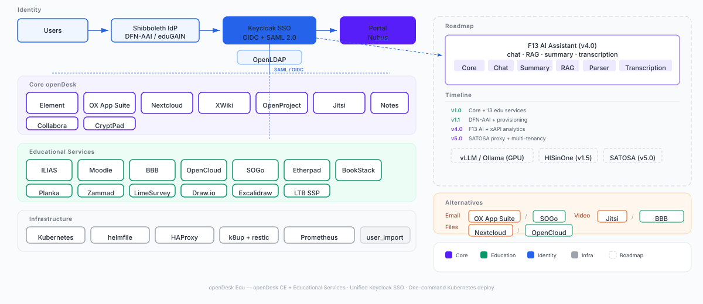
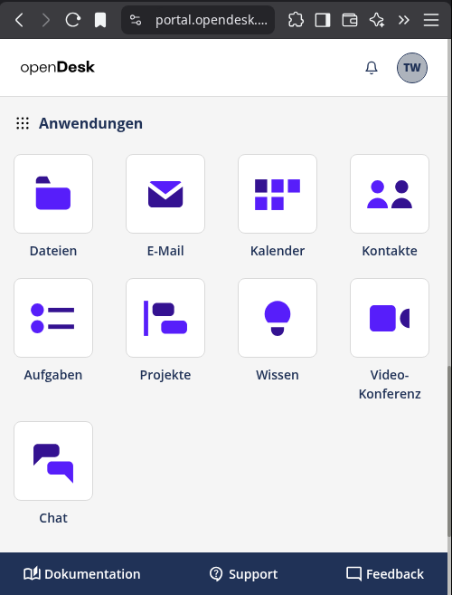
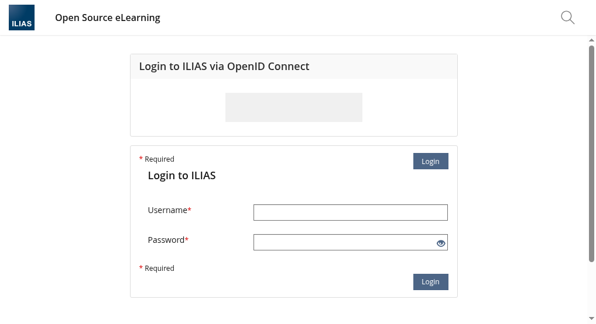
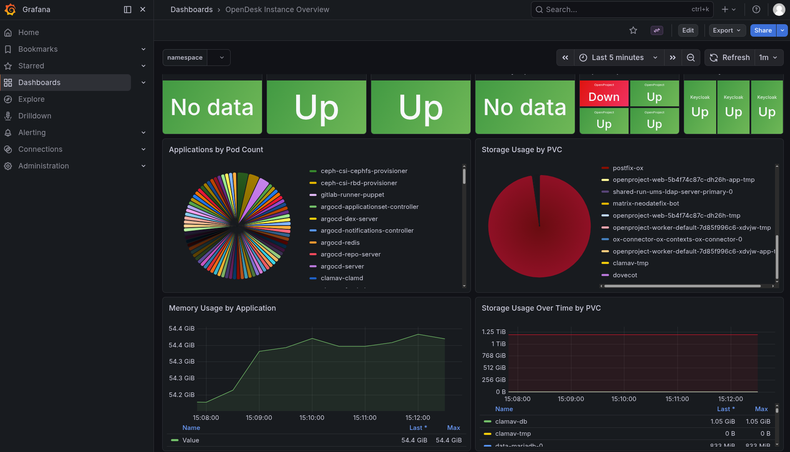

# openDesk Edu: Eine offene Plattform für digitale Hochschul-Infrastrukturen – Testen und mitgestalten

*Wie eine Gemeinschaftslösung den Betrieb von Bildungsdiensten vereinfachen kann – und warum Ihre Hochschule Teil davon werden sollte.*

*Veröffentlicht: Juli 2026*

---


*Eine kollaborative Plattform für Hochschulen – entwickelt von Hochschulen.*

---

## Einleitung

Digitale Lehr- und Forschungsinfrastrukturen sind für Hochschulen unverzichtbar – doch der Betrieb ist oft komplex, teuer und individuell. Während kommerzielle Lösungen Abhängigkeiten schaffen, fehlt es im Open-Source-Bereich häufig an **integrierten, modularen Plattformen**, die spezifische Anforderungen von Hochschulen abdecken.

Hier setzt **openDesk Edu** an: eine **kollaborativ entwickelte, Open-Source-basierte Lösung**, die 25+ Bildungsdienste unter einer gemeinsamen Architektur vereint – und jetzt **Testpartner und Mitgestalter** sucht.

---

## Was ist openDesk Edu?

openDesk Edu ist eine **modulare, Kubernetes-native Plattform**, die speziell für Hochschulen und Forschungseinrichtungen konzipiert wurde. Im Kern kombiniert sie:

- **Dienste für Lehre und Forschung**:
  Moodle, ILIAS, JupyterHub, Etherpad, Draw.io, Excalidraw, Nextcloud, SOGo (Groupware), Planka (Kanban), BookStack (Wiki) und weitere.

- **Infrastruktur-Komponenten**:
  Keycloak (SSO), MinIO (Objektspeicher), PostgreSQL/MariaDB, Redis, ClamAV (Virenprüfung), SeaweedFS (verteiltes Dateisystem).

- **Betriebsmodelle**:
  **Kubernetes (K3s)** für skalierbare Deployments,
  **Docker Compose** für kleinere Installationen.

**Ziel**: Eine **standardisierte, aber anpassbare Basis**, die Hochschulen den **eigenen Betrieb von Bildungsdiensten** ermöglicht – ohne Vendor Lock-in.

---

## Die Architektur: Ein System, das zusammenwächst


*Abbildung 1: Modulare Architektur von openDesk Edu mit Kubernetes, Ceph CSI und integrierten Diensten.*

Die Plattform basiert auf einer **containerisierten Mikroservice-Architektur**:
- **K3s Cluster** (9 Nodes) mit **Ceph CSI** für skalierbaren Speicher
- **Helmfile/Helm** für konsistente Deployment-Konfigurationen
- **Keycloak** als zentrale Identitätsmanagement-Lösung (SAML 2.0 + OIDC)
- **Automatisierte Backups** mit k8up und Restic

---

## Warum openDesk Edu? Die Herausforderungen

Hochschulen stehen vor ähnlichen Problemen:

1. **🔗 Fragmentierung**: Einzelne Dienste (Moodle hier, Nextcloud dort) erfordern separaten Aufwand für Authentifizierung, Backups und Wartung.
2. **📈 Komplexität**: Kubernetes und Helm sind mächtig, aber der Einstieg ist steil – besonders für kleinere Teams.
3. **🔒 Sicherheit**: Pentests zeigen immer wieder Lücken in Standard-Deployments. openDesk Edu integriert **Sicherheits-Hardening** von Anfang an.
4. **💰 Kosten**: Kommerzielle Lösungen sind teuer, Open-Source-Alternativen oft unverbunden.

**Unsere Antwort**:
✅ **Vorgefertigte Helm-Charts** (Bitnami-frei!) für alle Dienste – sofort einsatzbereit
✅ **Gemeinsame Authentifizierung** über Keycloak – Single Sign-On für alle Dienste
✅ **Automatisierte Backups** mit k8up (Restic) – Datenverlust vermeiden
✅ **Dokumentation und Best Practices** aus dem echten Betrieb (HRZ Marburg)

---

## Status quo: Wo stehen wir?

### ✅ 2026: Aktueller Status
- **Erste Produktiv-Installationen** an Partnerhochschulen
- **10+ Hochschulen** im Testbetrieb
- **Sicherheits-Assessment 2026** durchgeführt
- **DFN-Referenzimplementierung** in Vorbereitung

### 🎯 Q3/Q4 2026: Nächste Schritte
- **Ausweitung der Pilotphase** auf weitere Hochschulen
- **Monatliche Community-Calls** zur Abstimmung
- **Dokumentation** für den Produktivbetrieb finalisieren

---

## Das Portal: Ein Blick in die Praxis


*Abbildung 2: Das openDesk Edu Portal – zentrale Anlaufstelle für alle Dienste mit Single Sign-On.*

Das Portal bietet:
- **Unifizierte Bedingeroberfläche** für alle integrierten Dienste
- **Rollenbasierter Zugriff** für Studierende, Lehrende und Verwaltung
- **Personalisierte Dashboards** mit häufig genutzten Anwendungen
- **Integration mit DFN-AAI** für instituionsübergreifenden Zugriff

---

## Dienst-Beispiele: Was ist möglich?

### 📚 Lernmanagement


*Moodle – vollständig integriert mit SSO und automatischen Backups.*

### 🎓 E-Learning & Prüfen


*ILIAS – mit Shibboleth-Integration für sichere Authentifizierung.*

### 📊 Monitoring & Betrieb


*Grafana – Echtzeit-Monitoring aller Plattformkomponenten.*

---

## Kollaboration gesucht: Wie Sie mitmachen können

openDesk Edu ist **kein fertiges Produkt, sondern eine Initiative** – und wir brauchen **Ihre Expertise**. 

### 🧪 **1. Testen und Feedback geben**
- Zugang zur **Demo-Umgebung** anfordern
- **Lasttests** mit typischen Nutzungsmustern Ihrer Hochschule
- **Bug-Meldungen** über [GitLab-Issue-Tracker](https://gitlab.com/opendesk-edu/opendesk-edu)

### 🔧 **2. Dienste erweitern oder anpassen**
- **Fehlende Dienste** integrieren (z. B. Mahara, OpenOlat, Matrix/Element)
- **Anpassungen** für Ihre Infrastruktur (LDAP/AD-Integration)
- **Helm-Charts** für neue Anwendungen entwickeln

### 💬 **3. Betriebserfahrungen teilen**
- Wie betreiben **Sie** ähnliche Dienste?
- Welche **Herausforderungen** gab es in Ihrer Umgebung?
- Gibt es **Synergien** mit anderen Projekten?

### 📝 **4. Dokumentation und Schulung**
- **Tutorials** schreiben (z. B. "Installation auf lokalem K8s")
- **Workshops** anbieten (z. B. auf DFN-Tagungen)
- **Best Practices** dokumentieren

---

## Technische Highlights

| Feature | Nutzen | Status |
|---------|--------|--------|
| **Bitnami-freie Helm-Charts** | Keine externen Abhängigkeiten; volle Kontrolle | ✅ Produktiv |
| **k8up-Backup-Operator** | Automatisierte, inkrementelle Backups aller PVCs | ✅ Produktiv |
| **Ceph CSI Integration** | Skalierbarer Speicher mit Erasure Coding | ✅ Produktiv |
| **OX↔Nextcloud-Integration** | Nahtlose Verbindung Groupware ↔ Dateiablage | ✅ Produktiv |
| **Multi-Ingress Unterstützung** | Flexibles Routing (HAProxy + Nginx) | ✅ Produktiv |
| **Security by Design** | Pod Security Admission, Netzwerkrichtlinien | ✅ Produktiv |

---

## Stimmen aus der Community

> *„Früher haben wir Moodle, Nextcloud und Etherpad separat betrieben – mit eigenem SSO, eigenen Backups und eigener Wartung. Mit openDesk Edu sparen wir nicht nur Zeit, sondern haben auch eine **einheitliche Basis**, auf der wir aufbauen können.“*
> **— Tobias Weiß, HRZ Marburg**

> *„Die Integration von ILIAS mit Shibboleth war für uns ein kritischer Punkt. openDesk Edu hat dies aus der Box heraus funktioniert.“*
> **— [Name einfügen], [Hochschule einfügen]**

---

## Roadmap: Die nächsten Schritte

### 🗓️ Q3/Q4 2025: Pilotphase
- **5–10 Hochschulen** testen openDesk Edu in ihren Umgebungen
- **Monatliche Community-Calls** zur Abstimmung
- **Dokumentation** finalisieren

### 🎉 2026: Stabile Version 1.0
- Offizielle **DFN-Referenzimplementierung**
- **Zertifizierung** für den Hochschulbetrieb
- **Erste Produktiv-Installationen** an Partnerhochschulen

### 🚀 2027: Langfristige Ziele
- **Gehostete Variante** für Hochschulen ohne eigene K8s-Infrastruktur
- **Vollständige Integration mit DFN-Diensten** (DFN-AAI, DFN-Conf, etc.)
- **Erweiterung des Dienstekatalogs** basierend auf Community-Feedback

---

## Handlungsaufforderung: Werden Sie Teil der Initiative!

openDesk Edu lebt von **Ihrem Engagement**. Ob Sie nur testen, Code beitragen oder Betriebserfahrungen teilen möchten – **jeder Beitrag zählt**.

### 📌 Kontakt & Ressourcen
- **🌐 Projekt-Website**: [https://opendesk.edu](https://opendesk.edu)
- **🐙 GitLab**: [https://gitlab.com/opendesk-edu](https://gitlab.com/opendesk-edu)
- **✉️ E-Mail**: [opendesk-edu@hrz.uni-marburg.de](mailto:opendesk-edu@hrz.uni-marburg.de)
- **💬 Community-Chat**: [Matrix-Raum](#) *(Link einfügen)*

### 📅 Veranstaltungen
- **DFN-Tagung 2026**: Vortrag & Workshop (September 2026)
- **Monatliche Online-Treffen**: Termine auf Anfrage
- **Individuelle Demos**: Nach Absprache möglich

---

## Über die Autoren

| Autor | Rolle | Institution | Kontakt |
|-------|-------|-------------|---------|
| *[Ihr Name]* | [Ihre Position] | [Ihre Hochschule] | [Ihre E-Mail] |
| **Tobias Weiß** | Technischer Lead | HRZ Marburg | [E-Mail] |

---

## Quick Facts

| **Kategorie** | **Details** |
|---------------|------------|
| **📜 Lizenz** | Apache 2.0 / AGPL 3.0 (je nach Komponente) |
| **🛠️ Technologie** | Kubernetes (K3s), Helm, Ceph CSI, Restic |
| **📦 Aktuelle Version** | v1.0 (Stabil) |
| **🎯 Unterstützte Dienste** | 25+ (siehe [Dokumentation](https://docs.opendesk.edu)) |
| **👥 Community** | Offene Collaboration (Hochschulen, DFN, Unternehmen) |
| **💾 Storage-Backend** | Ceph (RBD für DBs, CephFS für Dateien) |
| **🔐 Authentifizierung** | Keycloak (SAML 2.0 + OIDC + DFN-AAI) |

---

## Für Techniker: Schnellstart

```bash
# 1. Repository klonen
git clone https://gitlab.com/opendesk-edu/opendesk-edu.git
cd opendesk-edu

# 2. Testumgebung mit Docker Compose (für Einsteiger)
cd opendesk-compose
docker-compose up -d

# 3. Oder: Kubernetes-Deployment mit Helmfile
cd helmfile
helmfile sync

# 4. Status prüfen
kubectl get pods -n opendesk
```

**Detaillierte Anleitung**: [Quickstart-Guide](https://docs.opendesk.edu/quickstart) |
**Fehlerbehebung**: [Debugging-Guide](https://docs.opendesk.edu/debugging)

---

## Für die Redaktion

### 📰 Platzierungsvorschläge
- **Aufmacher**: Fokus auf Kollaboration & Gemeinschaftsansatz
- **Fachbeitrag**: Technische Details zu Architektur und Betrieb
- **Interview**: Mit Tobias Weiß (Technischer Lead) oder [Ihr Name]

### 📷 Bildmaterial
Alle verwendeten Bilder stehen in **hoher Auflösung** zur Verfügung:
- `images/readme-lead-image.svg` – Titelbild (Vektor, skalierbar)
- `images/architecture-diagram.svg` – Architektur (Vektor)
- `images/opendesk-portal2.png` – Portal-Screenshot (1920×1080)
- `images/moodle.png`, `images/ilias-login.png`, `images/grafana.png` – Dienst-Beispiele

### 🔗 Weiterführende Links
- [Technische Dokumentation](https://docs.opendesk.edu)
- [Sicherheits-Assessment 2025](https://gitlab.com/opendesk-edu/opendesk-sec)
- [Präsentation LinuxTag 2026](https://gitlab.com/opendesk-edu/presentations)

---

*openDesk Edu – Gemeinsam. Offen. Für die Bildung.*
