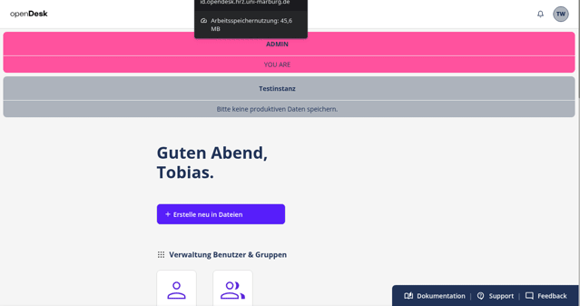

# openDesk Edu: Die offene Plattform für Hochschulen

*Wie ein modulares Ökosystem den Betrieb von Bildungsdiensten vereinfacht – und warum Ihre Hochschule Teil davon werden sollte.*

*Veröffentlicht: Juli 2026*

---

*Eine kollaborative Plattform für Hochschulen – entwickelt von Hochschulen.*

---

## Einleitung

Digitale Lehr- und Forschungsinfrastrukturen sind für Hochschulen unverzichtbar – doch der Betrieb ist oft komplex, teuer und individuell. Während kommerzielle Lösungen wie Microsoft 365 Abhängigkeiten schaffen, fehlt es im Open-Source-Bereich häufig an **integrierten, modularen Plattformen**, die spezifische Anforderungen von Hochschulen abdecken.

Hier setzt **openDesk Edu** an: ein **kollaborativ entwickeltes, modulares Ökosystem**, das Bildungsdienste als **austauschbare Komponenten** bereitstellt – und jetzt **Testpartner und Mitgestalter** sucht.

---

## Was ist openDesk Edu?

openDesk Edu ist eine **modulare, Kubernetes-native Plattform**, die speziell für Hochschulen und Forschungseinrichtungen konzipiert wurde.

| **Kategorie**       | **Optionen**                          | **Vorteile**                          |
|----------------------|---------------------------------------|---------------------------------------|
| **Lernmanagement**   | Moodle, ILIAS                          | Integriert mit SSO & Backups         |
| **Zusammenarbeit**   | Nextcloud, Etherpad, Draw.io           | Nahtlose Dateifreigabe                |
| **Groupware**        | SOGo, Grommunio, OpenXchange           | E-Mail, Kalender, Kontakte            |
| **Dateiablage**      | Nextcloud, OpenCloud                   | Kein Vendor Lock-in                  |
| **Infrastruktur**    | Keycloak, MinIO, Ceph CSI              | Zentrale Auth & skalierbarer Speicher |
| **Betrieb**          | Kubernetes (K3s), Helmfile, k8up       | Automatisiert & reproduzierbar       |

**Ziel**: Eine **standardisierte, aber anpassbare Basis**, die Hochschulen den **eigenen Betrieb von Bildungsdiensten** ermöglicht – ohne Vendor Lock-in.

---

## Die Architektur: Ein System, das zusammenwächst

*Das openDesk Edu Ökosystem – alle integrierten Dienste auf einen Blick. Interaktive Version: [landscape.opendesk-edu.org](https://landscape.opendesk-edu.org/)*

Die Plattform basiert auf einer **containerisierten Mikroservice-Architektur**:
- **K3s Cluster** (9 Nodes) mit **Ceph CSI** für skalierbaren Speicher
- **Helmfile/Helm** für konsistente Deployment-Konfigurationen
- **Keycloak** als zentrale Identitätsmanagement-Lösung (SAML 2.0 + OIDC)
- **Automatisierte Backups** mit k8up und Restic

---

## Warum openDesk Edu? Die Herausforderungen

### 🔄 Ein Ökosystem, kein Monolith
openDesk Edu ist **kein Monolith**, sondern ein **modulares System**, in dem **jeder Dienst austauschbar** ist.
Wir wollen **nicht von einer Abhängigkeit (z. B. Microsoft 365) in die nächste (z. B. Nextcloud als einziger Anbieter) wechseln**. Jede Hochschule soll selbst entscheiden, welche Dienste sie einsetzt – heute und in Zukunft.

### Die Probleme im Detail
1. **🔗 Fragmentierung**: Einzelne Dienste (Moodle hier, Nextcloud dort) erfordern separaten Aufwand für Authentifizierung, Backups und Wartung.
2. **📈 Komplexität**: Kubernetes und Helm sind mächtig, aber der Einstieg ist steil – besonders für kleinere Teams.
3. **🔒 Sicherheit**: Pentests zeigen immer wieder Lücken in Standard-Deployments. openDesk Edu integriert **Sicherheits-Hardening** von Anfang an.
4. **💰 Kosten**: Kommerzielle Lösungen sind teuer, Open-Source-Alternativen oft unverbunden.
5. **🔒 Vendor Lock-in**: Der Wechsel von Microsoft zu einer einzelnen Open-Source-Alternative löst das Problem nicht, wenn die neue Lösung ebenfalls proprietäre Schnittstellen oder Formate nutzt.

### Unsere Antwort
✅ **Vorgefertigte Helm-Charts** (Bitnami-frei!) für alle Dienste – sofort einsatzbereit
✅ **Gemeinsame Authentifizierung** über Keycloak – Single Sign-On für alle Dienste
✅ **Automatisierte Backups** mit k8up (Restic) – Datenverlust vermeiden
✅ **Dokumentation und Best Practices** aus dem echten Betrieb (HRZ Marburg)
✅ **Austauschbare Module** – Groupware, Dateiablage, Lernmanagement: Die Hochschule entscheidet

---

## Ausgangspunkt: Der Offene Brief

Die Initiative für openDesk Edu geht auf den **[Offenen Brief an den Herrn Bundesminister für Digitales und Staatsmodernisierung (BMDs)](https://pak-digs.gi.de/mitteilung/offener-brief-an-den-herrn-bundesminister-fuer-digitales-und-staatsmodernisierung-bmds-digitale-souveraenitaet-an-hochschulen-dringender-handlungsbedarf-fuer-eine-faire-marktsituation-opendesk-vs-microsoft)** zurück, der von der **Gesellschaft für Informatik e.V.** veröffentlicht wurde.

Darin fordern der **Präsidiumsarbeitskreis „Digitale Souveränität"**, die Arbeitskreise **„Open Source Software"** und **„Datenschutz und IT-Sicherheit"** sowie der **ZKI e.V.** mehr digitale Souveränität an Hochschulen und sehen **dringenden Handlungsbedarf für eine faire Marktsituation** im Vergleich openDesk vs. Microsoft.

Dieser Brief war der Ausgangspunkt für die Gründung von **[openDesk Edu](https://opendesk-edu.org/en)** – einer hochschulspezifischen Erweiterung von openDesk CE.

---

## Aktuelle Einsatzgebiete von openDesk

openDesk **CE** (Community Edition) wird bereits in mehreren Bundesländern produktiv eingesetzt:

| **Bundesland**       | **Projekt** | **Link** |
|----------------------|-------------|----------|
| **Baden-Württemberg** | Digitaler Arbeitsplatz für Lehrkräfte | [Pressemitteilung](https://www.baden-wuerttemberg.de/de/service/presse/pressemitteilung/pid/digitaler-arbeitsplatz-fuer-lehrkraefte-wird-nun-mit-opendesk-umgesetzt-1) |
| **Schleswig-Holstein** | Linux+1 (Open-Source-Strategie) | [Pressemitteilung](https://www.schleswig-holstein.de/DE/landesregierung/themen/digitalisierung/linux-plus1) |

**openDesk Edu** (die hochschulspezifische Variante) befindet sich aktuell in der **Testphase am HRZ Marburg** auf einem 9-Knoten-K3s-Cluster. Das Projekt ist unter **[https://opendesk-edu.org](https://opendesk-edu.org/en)** dokumentiert.

---

## Das Portal: Ein Blick in die Praxis

*Ein Login – Zugang zu allen Diensten.*

Das Portal bietet:
- **Einheitliche Benutzeroberfläche** für alle integrierten Dienste
- **Rollenbasierter Zugriff** für Studierende, Lehrende und Verwaltung
- **Personalisierte Dashboards** mit häufig genutzten Anwendungen
- **Integration mit DFN-AAI** für institutionsübergreifenden Zugriff

---

## Dienst-Beispiele: Was ist möglich?

### 📚 Lernmanagement & E-Learning

*ILIAS – mit Shibboleth-Integration für sichere Authentifizierung und automatische Anmeldung.*

Moodle und ILIAS sind über SSO (SAML 2.0) voll in die Plattform integriert – inklusive automatischer Backups und zentraler Benutzerverwaltung.

### 📊 Monitoring & Betrieb

*Grafana – Echtzeit-Monitoring aller Plattformkomponenten.*

---

## Kollaboration gesucht: Wie Sie mitmachen können

openDesk Edu ist **kein fertiges Produkt, sondern eine Initiative** – und wir suchen **Ihre Expertise**.

### 🧪 **1. Testen und Feedback geben**
- **Eval-Umgebung** aufsetzten (Community of Practice für Fragen nutzen)
- **Lasttests** mit typischen Nutzungsmustern Ihrer Hochschule
- **Bug-Meldungen** über [GitLab-Issue-Tracker](https://gitlab.com/opendesk-edu/opendesk-edu/issues)

### 🔧 **2. Dienste erweitern oder anpassen**
- **Fehlende Dienste** integrieren (z. B. Mahara, OpenOlat, Matrix/Element)
- **Anpassungen** für Ihre Infrastruktur (LDAP/AD-Integration)
- **Helm-Charts** für neue Anwendungen entwickeln

### 💬 **3. Betriebserfahrungen teilen**
- Wie betreiben **Sie** ähnliche Dienste?
- Welche **Herausforderungen** gab es in Ihrer Umgebung?
- Gibt es **Synergien** mit anderen Projekten?

### 📝 **4. Dokumentation und Schulung**
- **Tutorials** schreiben (z. B. "Installation auf lokalem K8s")
- **Workshops** anbieten (z. B. auf DFN-Tagungen)
- **Best Practices** dokumentieren

---

## Technische Highlights

| Feature | Nutzen | Status |
|---------|--------|--------|
| **Bitnami-freie Helm-Charts** | Keine externen Abhängigkeiten; volle Kontrolle | ✅ Produktiv |
| **k8up-Backup-Operator** | Automatisierte, inkrementelle Backups aller PVCs | ✅ Produktiv |
| **Ceph CSI Integration** | Skalierbarer Speicher mit Erasure Coding | ✅ Produktiv |
| **OX↔Nextcloud-Integration** | Nahtlose Verbindung Groupware ↔ Dateiablage | ✅ Produktiv |
| **Multi-Ingress Unterstützung** | Flexibles Routing (HAProxy + Nginx) | ✅ Produktiv |
| **Security by Design** | Pod Security Admission, Netzwerkrichtlinien | ✅ Produktiv |

---

## Roadmap

| **Zeitraum**  | **Meilenstein**                          | **Status**       |
|---------------|------------------------------------------|------------------|
| **Q3 2026**   | Pilotphase mit ersten Hochschulen        | 🟡 Laufend       |
| **Q4 2026**   | Dokumentation für Produktivbetrieb       | 🟡 Geplant       |
| **Q1 2027**   | Gehostete Variante (Beta)                | 🟢 In Planung    |
| **Q2 2027**   | Vollständige DFN-AAI-Integration         | 🟢 In Planung    |

---

## Werden Sie Teil der Initiative!

openDesk Edu lebt von **Ihrem Engagement**. 
Ob Sie nur testen, Code beitragen oder Betriebserfahrungen teilen möchten – **jeder Beitrag zählt**. 

### 📌 Kontakt
**Ansprechpartner für den Artikel**:
> **Tobias Weiß**
> Abteilung Zentrale Systeme
> Hochschulrechenzentrum (HRZ)
> Philipps-Universität Marburg
> 📧 [tobias.weiss@uni-marburg.de](mailto:tobias.weiss@uni-marburg.de)
> 💬 [Matrix](https://matrix.to/#/@weissto:matrix.uni-marburg.de)
> 🌐 [https://www.uni-marburg.de/de/hrz](https://www.uni-marburg.de/de/hrz)

**Projekt-Repositories**:
- **🌐 Projekt-Website**: [https://opendesk-edu.org](https://opendesk-edu.org/en)
- **🗺️ Ökosystem-Landscape**: [https://landscape.opendesk-edu.org](https://landscape.opendesk-edu.org/)
- **🐙 GitLab**: [https://gitlab.com/opendesk-edu](https://gitlab.com/opendesk-edu)

### 📅 Veranstaltungen
- **Community of Practice Calls**: Quartalsweise (Termine im [opendesk-edu-cop](https://gitlab.com/opendesk-edu/opendesk-edu-cop) Repo)
- **Individuelle Hilfestellung/Demos**: Nach Absprache möglich

---

## Quick Facts

| **Kategorie** | **Details** |
|---------------|------------|
| **📜 Lizenz** | Apache 2.0 / AGPL 3.0 (je nach Komponente) |
| **🛠️ Technologie** | Kubernetes (K3s), Helm, Ceph CSI, Restic |
| **📦 Aktuelle Version** | Testphase |
| **🎯 Unterstützte Dienste** | 28+ (siehe [Dokumentation](https://docs.opendesk-edu.org)) |
| **👥 Community** | Offene Collaboration (Hochschulen, DFN, Unternehmen) |
| **💾 Storage-Backend** | Ceph (RBD für DBs, CephFS für Dateien) |
| **🔐 Authentifizierung** | Keycloak (SAML 2.0 + OIDC + DFN-AAI) |

---

## Für die Redaktion

### 📰 Platzierungsvorschläge
- **Aufmacher**: Fokus auf Kollaboration & Gemeinschaftsansatz
- **Fachbeitrag**: Technische Details zu Architektur und Betrieb
- **Interview**: Mit Tobias Weiß (HRZ Marburg)

**Zielgruppe**:
- IT-Entscheider an Hochschulen
- Systemadministratoren
- DFN-Mitglieder

### 📷 Bildmaterial
- `images/readme-lead-image.svg` – Titelbild (Vektor, skalierbar)
- `images/opendesk-portal2.png` – Portal-Screenshot (1920×1080)
- `images/opendesk-edu-ilias-integration.gif` – ILIAS SSO-Integration (animiert)
- `images/grafana.png` – Grafana-Dashboard
- [landscape.opendesk-edu.org](https://landscape.opendesk-edu.org/) – Interaktives Ökosystem-Diagramm

### 🔗 Weiterführende Links
- [openDesk Edu Landscape – Ökosystem-Übersicht](https://landscape.opendesk-edu.org/)
- [Offener Brief (PAK DiGS / GI e.V.)](https://pak-digs.gi.de/mitteilung/offener-brief-an-den-herrn-bundesminister-fuer-digitales-und-staatsmodernisierung-bmds-digitale-souveraenitaet-an-hochschulen-dringender-handlungsbedarf-fuer-eine-faire-marktsituation-opendesk-vs-microsoft)
- [Baden-Württemberg: Digitaler Arbeitsplatz für Lehrkräfte](https://www.baden-wuerttemberg.de/de/service/presse/pressemitteilung/pid/digitaler-arbeitsplatz-fuer-lehrkraefte-wird-nun-mit-opendesk-umgesetzt-1)
- [Schleswig-Holstein: Linux+1 Open-Source-Strategie](https://www.schleswig-holstein.de/DE/landesregierung/themen/digitalisierung/linux-plus1)
- [Technische Dokumentation](https://docs.opendesk-edu.org)

---

*openDesk Edu – Offen. Austauschbar. Unabhängig.*
