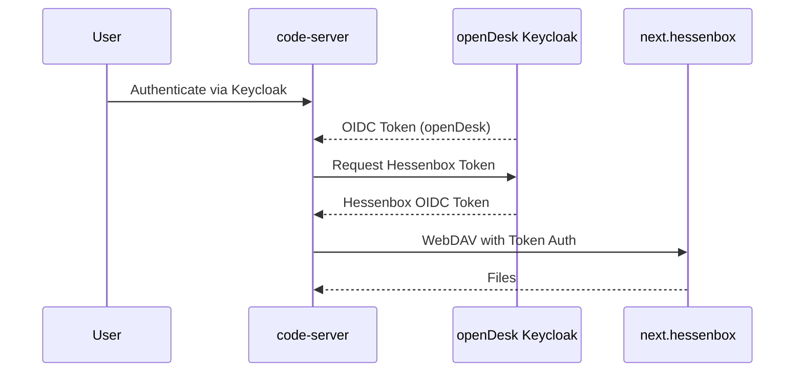

# next.hessenbox Integration Plan

> **Status:** Draft  
> **Owner:** Tobias Weiss  
> **Priority:** High  
> **Target:** Q3 2026

## Overview

**next.hessenbox** (https://next.hessenbox.de) is a **state-wide Sync&Share service** operated by the University of Kassel (ITS) as part of the Hessian university cooperation. It provides:

- **50 GB storage per user** (all Marburg university members)
- **Cross-university collaboration** (sharing with other Hessian universities)
- **External collaboration** (guest access without storage quota)
- **Existing production service** (no infrastructure to manage)

### Current State

| Service | next.hessenbox Integration | openDesk Alternative | Priority |
|---------|----------------------------|----------------------|----------|
| **SSO** | ❌ Not configured | ✅ Keycloak OIDC | ⭐⭐⭐⭐⭐ |
| **code-server** | ❌ Not integrated | ✅ OpenCloud sidecar | ⭐⭐⭐ |
| **RStudio** | ❌ Not integrated | ✅ OpenCloud sidecar | ⭐⭐⭐ |
| **JupyterHub** | ❌ Not integrated | ❌ Not yet | ⭐⭐⭐ |
| **Slidev** | ❌ Not integrated | ❌ Not yet | ⭐⭐ |
| **Portal** | ❌ No file picker | ✅ OpenCloud tile | ⭐⭐⭐⭐ |
| **Email** | ❌ Not integrated | ✅ SOGo | ⭐⭐ |

## Goals

### Phase 1: SSO Integration (Week 1)
Enable Single Sign-On between openDesk Edu and next.hessenbox.

**Success Criteria:**
- [ ] Users can access next.hessenbox via openDesk portal without re-authenticating
- [ ] Keycloak OIDC client configured for next.hessenbox
- [ ] next.hessenbox configured to trust openDesk Keycloak as IdP

### Phase 2: Collab Service Integration (Week 2-3)
Enable next.hessenbox storage in collab services (code-server, RStudio, JupyterHub, Slidev).

**Success Criteria:**
- [ ] code-server: Users can access next.hessenbox files via sidecar
- [ ] RStudio: Users can access next.hessenbox files via sidecar
- [ ] JupyterHub: Users can access next.hessenbox files via sidecar
- [ ] Slidev: Users can access next.hessenbox files via sidecar

### Phase 3: Portal Integration (Week 4)
Full next.hessenbox experience in openDesk portal.

**Success Criteria:**
- [ ] next.hessenbox tile in portal
- [ ] File picker component for services
- [ ] Usage statistics in portal

### Phase 4: Advanced Features (Optional)
- [ ] WebDAV proxy through openDesk (avoid direct Kassel access)
- [ ] Local caching for performance
- [ ] Offline sync capabilities

---

## Architecture

### Phase 1: Direct Integration

```
┌─────────────────────────────────────────────────────────────┐
│                     openDesk Edu (SCS)                      │
│                                                             │
│  ┌─────────────┐    ┌─────────────┐    ┌─────────────┐      │
│  │   Portal    │    │  Keycloak   │    │  Services   │      │
│  │             │    │  (OIDC IdP)│    │ (code-server│      │
│  │  +--------+ │    │             │    │   RStudio   │      │
│  │  │hessenbox│─┼───►│  +--------+ │    │   etc...)   │      │
│  │  │  Tile   │ │    │  │OIDC    │ │    │             │      │
│  │  +--------+ │    │  │Client  │ │    │             │      │
│  │             │    │  │hessenbox│ │    │             │      │
│  └─────────────┘    │  +--------+ │    └─────────┬──────┘      │
│                     └─────────────┘              │             │
└─────────────────────────────────────────────────┼─────────────┘
                                                      │
                                                      ▼
┌─────────────────────────────────────────────────────────────┐
│                next.hessenbox (ITS Kassel)                 │
│                                                             │
│  ┌─────────────────────────────────────────────────────┐    │
│  │                   OIDC Provider                    │    │
│  │              (or SAML if OIDC not supported)       │    │
│  └─────────────────────────────────────────────────────┘    │
│                                                             │
│  ┌─────────────────────────────────────────────────────┐    │
│  │                    OwnCloud                        │    │
│  │                  (Nextcloud 19)                   │    │
│  └─────────────────────────────────────────────────────┘    │
└─────────────────────────────────────────────────────────────┘
```

### Phase 2: Sidecar-based Service Integration

```
┌─────────────────────────────────────────────────────────────┐
│                     Service Pod (code-server)               │
│                                                             │
│  ┌─────────────┐    ┌─────────────────────────┐          │
│  │ code-server │    │   rclone sidecar         │          │
│  │             │    │ (next.hessenbox sync)   │          │
│  │  /workspace  │◄──►│  /sync                  │          │
│  │  - projects/│    │  - next.hessenbox/      │          │
│  │  - notebooks/│    │    - user-files/        │          │
│  │             │    │    - shared-files/      │          │
│  └─────────────┘    └─────────────────────────┘          │
│                        ▲                              │
│                        │                              │
│                        ▼                              │
│  ┌──────────────────────────────────────────────────┐   │
│  │              WebDAV Connection                    │   │
│  │   https://next.hessenbox.de/remote.php/dav/        │   │
│  └──────────────────────────────────────────────────┘   │
└─────────────────────────────────────────────────────────────┘
```

---

## Implementation

### Phase 1: SSO Integration

#### 1.1 Configure Keycloak OIDC Client for next.hessenbox

**File:** `k8s/keycloak/clients/hessenbox.yaml` (new)

```yaml
apiVersion: keycloak.org/v1alpha1
kind: KeycloakClient
metadata:
  name: hessenbox
  namespace: opendesk
  labels:
    app: keycloak-client
    service: hessenbox
spec:
  realmSelector:
    matchLabels:
      app: opendesk
  client:
    clientId: hessenbox
    name: next.hessenbox
    enabled: true
    protocol: openid-connect
    publicClient: false
    standardFlowEnabled: true
    directAccessGrantsEnabled: true
    implicitFlowEnabled: false
    
    redirectUris:
      - "https://next.hessenbox.de/*"
      - "https://files.opendesk-edu.org/*"
    
    webOrigins:
      - "https://next.hessenbox.de"
      - "https://files.opendesk-edu.org"
    
    attributes:
      "access.token.lifespan": "3600"
      "refresh.token.lifespan": "86400"
      "pkce.code.challenge.method": "S256"
    
    protocolMappers:
      - name: username
        protocol: openid-connect
        protocolMapper: oidc-usermodel-property-mapper
        config:
          user.attribute: username
          claim.name: preferred_username
          jsonType.label: String
          multivalued: false
      - name: email
        protocol: openid-connect
        protocolMapper: oidc-usermodel-property-mapper
        config:
          user.attribute: email
          claim.name: email
          jsonType.label: String
          multivalued: false
      - name: groups
        protocol: openid-connect
        protocolMapper: oidc-usermodel-realm-role-mapper
        config:
          multivalued: true
          claim.name: groups
```

#### 1.2 Configure next.hessenbox to Trust openDesk Keycloak

**Requires Kassel admin action:**

1. Register openDesk as OIDC client in next.hessenbox
2. Configure redirect URIs:
   - `https://id.home.opendesk-edu.org/oauth2/callback`
   - `https://id.desk-test.uni-marburg.de/oauth2/callback`
3. Share client ID and secret with openDesk team

**OR** if next.hessenbox supports SAML:
- Configure SAML SP in next.hessenbox
- Point to openDesk Keycloak SAML IdP endpoint

#### 1.3 Create Portal Tile for next.hessenbox

**File:** `portal-entries/entries/hessenbox.ldif`

```ldif
# next.hessenbox Portal Entry
dn: cn=hessenbox,ou=entries,dc=opendesk,dc=edu
objectClass: organizationalRole
objectClass: simpleSecurityObject
cn: hessenbox
userPassword: {SSHA}redacted
roleOccupant: cn=hessenbox,ou=services,dc=opendesk,dc=edu

# next.hessenbox Service Entry
dn: cn=hessenbox,ou=services,dc=opendesk,dc=edu
objectClass: organizationalRole
objectClass: simpleSecurityObject
cn: hessenbox
description: next.hessenbox - 50GB Cloud Storage
displayName: next.hessenbox
tileOrder: 15
icon: hessenbox
url: https://next.hessenbox.de
color: #0082c9
target: _blank
```

Icon file: `helmfile/files/theme/edu_services/hessenbox.svg` (to be created)

---

### Phase 2: Collab Service Integration

#### 2.1 Create Sidecar Chart for next.hessenbox

**File:** `helmfile/charts/hessenbox-sidecar/Chart.yaml`

```yaml
# SPDX-FileCopyrightText: 2026 openDesk Edu Contributors
# SPDX-License-Identifier: Apache-2.0
apiVersion: v2
name: hessenbox-sidecar
description: next.hessenbox storage sync via rclone sidecar deployment
type: application
version: 0.1.0
appVersion: "1.0.0"
```

**File:** `helmfile/charts/hessenbox-sidecar/templates/deployment.yaml`

```yaml
apiVersion: apps/v1
kind: Deployment
metadata:
  name: {{ include "hessenbox-sidecar.fullname" . }}
  labels:
    {{- include "hessenbox-sidecar.labels" . | nindent 4 }}
spec:
  replicas: 1
  selector:
    matchLabels:
      {{- include "hessenbox-sidecar.selectorLabels" . | nindent 6 }}
  template:
    metadata:
      labels:
        {{- include "hessenbox-sidecar.selectorLabels" . | nindent 8 }}
      annotations:
        checksum/config: {{ include (print $.Template.BasePath "/secret.yaml") . | sha256sum }}
    spec:
      serviceAccountName: {{ include "hessenbox-sidecar.serviceAccountName" . }}
      containers:
        - name: rclone-sync
          image: "{{ .Values.image.repository }}:{{ .Values.image.tag }}"
          imagePullPolicy: {{ .Values.image.pullPolicy }}
          command:
            - sh
            - -c
            - |
              # Create rclone config
              mkdir -p ~/.config/rclone
              cat > ~/.config/rclone/rclone.conf << 'EOCONF'
[hessenbox]
type = webdav
url = https://next.hessenbox.de/remote.php/dav/files/{{ .Values.hessenbox.username }}
vendor = nextcloud
user = {{ .Values.hessenbox.username }}
pass = {{ .Values.hessenbox.password }}
EOCONF
              # Initial sync
              rclone sync hessenbox:{{ .Values.hessenbox.remotePath }} /data/ -v
              # Continuous sync
              while true; do
                echo "Syncing next.hessenbox..."
                rclone sync hessenbox:{{ .Values.hessenbox.remotePath }} /data/ \
                  --verbose --progress --fast-list
                rclone sync /data/ hessenbox:{{ .Values.hessenbox.remotePath }} \
                  --verbose --progress --fast-list
                sleep {{ .Values.hessenbox.syncInterval }}
              done
          volumeMounts:
            - name: data
              mountPath: /data
          resources:
            {{- toYaml .Values.resources | nindent 12 }}
          env:
            - name: TZ
              value: {{ .Values.timezone | default "Europe/Berlin" | quote }}
      volumes:
        - name: data
          emptyDir: {}
```

#### 2.2 Create next.hessenbox Sidecar Values

**File:** `helmfile/charts/hessenbox-sidecar/values.yaml`

```yaml
# Default values for hessenbox-sidecar

image:
  repository: rclone/rclone
  tag: latest
  pullPolicy: IfNotPresent

hessenbox:
  # URL is fixed for next.hessenbox
  url: "https://next.hessenbox.de/remote.php/dav"
  # Username will be injected per-service from Keycloak/OIDC
  username: ""
  # Password/app token - should use OIDC token exchange in production
  password: ""
  # Remote path in next.hessenbox
  remotePath: "/"
  # Sync interval in seconds
  syncInterval: 60

timezone: "Europe/Berlin"

resources:
  requests:
    cpu: 100m
    memory: 128Mi
  limits:
    cpu: 500m
    memory: 512Mi
```

#### 2.3 Integrate Sidecar with code-server

**File:** `helmfile/apps/edu/code-server/values.yaml.gotmpl` (update)

```yaml
# ... existing values ...

# next.hessenbox integration
next_hessenbox:
  enabled: {{ .Values.apps.code_server.next_hessenbox.enabled | default false }}
  # When enabled, mounts hessenbox storage at /home/coder/project/hessenbox
  mountPath: "/home/coder/project/hessenbox"

# OpenCloud integration (keep for backwards compatibility)
opencloud:
  enabled: {{ .Values.apps.code_server.opencloud.enabled | default false }}
  # ... existing opencloud values ...
```

**File:** `helmfile/apps/edu/code-server/templates/code-server-deployment.yaml` (new section)

```yaml
{{- if .Values.next_hessenbox.enabled }}
        - name: hessenbox-sync
          image: "rclone/rclone:latest"
          command:
            - sh
            - -c
            - |
              # Create rclone config from environment
              mkdir -p ~/.config/rclone
              cat > ~/.config/rclone/rclone.conf << EOCONF
[hessenbox]
type = webdav
url = https://next.hessenbox.de/remote.php/dav/files/$(OIDC_USERNAME)
vendor = nextcloud
user = $(OIDC_USERNAME)
pass = $(HESSENBOX_TOKEN)
EOCONF
              # Continuous sync
              while true; do
                echo "Syncing next.hessenbox for $(OIDC_USERNAME)..."
                rclone sync hessenbox:/ /data/ -v --fast-list || true
                rclone sync /data/ hessenbox:/ -v --fast-list || true
                sleep {{ .Values.next_hessenbox.syncInterval | default 60 }}
              done
          volumeMounts:
            - name: hessenbox-data
              mountPath: /data
            - name: hessenbox-config
              mountPath: /root/.config/rclone
          env:
            - name: OIDC_USERNAME
              valueFrom:
                secretKeyRef:
                  name: code-server-oidc
                  key: username
            - name: HESSENBOX_TOKEN
              valueFrom:
                secretKeyRef:
                  name: hessenbox-credentials
                  key: token
{{- end }}
```

---

### Phase 3: OIDC Token Exchange (Advanced)

Instead of using username/password, implement **OIDC token exchange** for better security:



**Implementation:**
- Use Keycloak's **Token Exchange** feature (RFC 8693)
- Or implement a **sidecar proxy** that exchanges openDesk token for Hessenbox token

---

## Service Integration Matrix

| Service | Integration Type | Priority | Status | Dependencies |
|---------|------------------|----------|--------|--------------|
| **Portal** | Tile + File Picker | ⭐⭐⭐⭐ | ❌ Not Done | SSO, Icons |
| **code-server** | Sidecar | ⭐⭐⭐ | ❌ Not Done | Sidecar chart |
| **RStudio** | Sidecar | ⭐⭐⭐ | ❌ Not Done | Sidecar chart |
| **JupyterHub** | Sidecar | ⭐⭐⭐ | ❌ Not Done | Sidecar chart |
| **Slidev** | Sidecar | ⭐⭐ | ❌ Not Done | Sidecar chart |
| **SOGo** | External Storage | ⭐⭐ | ❌ Not Done | EWS API |
| **Etherpad** | File Import/Export | ⭐ | ❌ Not Done | Plugin |
| **BookStack** | External Storage | ⭐ | ❌ Not Done | WebDAV plugin |

---

## Testing

### Test Cases

#### Phase 1: SSO Integration
1. **Portal to Hessenbox**
   - [ ] Click Hessenbox tile in portal
   - [ ] Should redirect to next.hessenbox without login prompt
   - [ ] Should land on user's files page

2. **Direct Access**
   - [ ] Visit `https://next.hessenbox.de` directly
   - [ ] Should offer "Login with openDesk" option
   - [ ] Should authenticate via Keycloak

#### Phase 2: Service Integration
1. **code-server Integration**
   - [ ] Launch code-server
   - [ ] Should see `hessenbox/` directory in workspace
   - [ ] Create file in `hessenbox/`
   - [ ] Should appear in next.hessenbox web UI
   - [ ] Delete file in next.hessenbox web UI
   - [ ] Should disappear from code-server

2. **RStudio Integration**
   - [ ] Launch RStudio
   - [ ] Should see `hessenbox/` in Files pane
   - [ ] Same bidirectional sync test as code-server

---

## Rollout Plan

| Phase | Timeline | Tasks | Owner |
|-------|----------|-------|-------|
| **Phase 0: Preparation** | Week 0 | Gather requirements, create tickets | Tobias |
| **Phase 1: SSO** | Week 1 | Configure Keycloak, next.hessenbox, portal | Tobias + Kassel |
| **Phase 2: code-server** | Week 2 | Sidecar integration, testing | Tobias |
| **Phase 3: RStudio** | Week 2 | Sidecar integration, testing | Tobias |
| **Phase 4: JupyterHub** | Week 3 | Sidecar integration, testing | Tobias |
| **Phase 5: Slidev** | Week 3 | Sidecar integration, testing | Tobias |
| **Phase 6: Production** | Week 4 | Cutover, monitoring, documentation | Team |

---

## Risks & Mitigations

| Risk | Impact | Probability | Mitigation |
|------|--------|-------------|------------|
| Kassel doesn't support OIDC | High | Low | Use SAML fallback |
| WebDAV performance issues | Medium | Medium | Implement local caching |
| Token expiration | Medium | Medium | Implement token refresh |
| Storage quota issues | Low | Low | Monitor and alert |
| Network latency to Kassel | Medium | High | Implement proxy/local cache |
| User confusion (2 storage systems) | Medium | High | Clear documentation, naming |

---

## Success Metrics

| Metric | Target | Measurement |
|--------|--------|-------------|
| SSO adoption rate | >80% | % of users using SSO after 1 month |
| Service integration | 4 services | Number of services with sidecar |
| User satisfaction | >4.5/5 | Survey after 1 month |
| Zero incidents | 0 | Number of P1 incidents in first month |
| Performance | <2s sync | Average sync latency |

---

## Open Questions

1. **Does next.hessenbox support OIDC or only SAML?**
   - Need confirmation from Kassel admin
   - If only SAML: use Keycloak SAML proxy

2. **What are the rate limits for next.hessenbox WebDAV API?**
   - Need to understand scaling requirements
   - May need to implement client-side throttling

3. **Can we get a service account with broader access?**
   - For system-level integrations
   - For backup purposes

4. **What's the SLA for next.hessenbox?**
   - Need to understand reliability guarantees
   - For our SLA commitments

5. **How does next.hessenbox handle external users?**
   - Guest access workflow
   - Sharing with non-Hessian universities

---

## Appendix

### A. next.hessenbox Technical Details

- **Platform:** Nextcloud 19+
- **Operator:** ITS, Universität Kassel
- **URL:** https://next.hessenbox.de
- **API:** WebDAV (https://next.hessenbox.de/remote.php/dav/)
- **Authentication:** 
  - Primary: Shibboleth (SAML)
  - Secondary: OIDC (if configured)
  - Fallback: Local accounts
- **Storage Quota:** 50 GB per user
- **Sharing:** Cross-university within Hessen

### B. Related Documentation

- [next.hessenbox User Documentation](https://www.uni-marburg.de/de/hrz/dienste/sync-share)
- [next.hessenbox Admin Documentation](https://next.hessenbox.de)
- [Nextcloud WebDAV API](https://docs.nextcloud.com/server/latest/developer_manual/client_apis/WebDAV/)
- [rclone WebDAV Documentation](https://rclone.org/webdav/)

### C. File Locations

- Keycloak Client: `k8s/keycloak/clients/hessenbox.yaml`
- Portal Entry: `portal-entries/entries/hessenbox.ldif`
- Portal Icon: `helmfile/files/theme/edu_services/hessenbox.svg`
- Sidecar Chart: `helmfile/charts/hessenbox-sidecar/`
- Service Configs: `helmfile/apps/edu/{service}/`

### D. Contacts

| Role | Person | Contact | Organization |
|------|--------|---------|-------------|
| Service Owner | Gebhardt | nextbox@hrz.uni-marburg.de | HRZ Marburg |
| Service Manager | Weiß | tobias.weiss@uni-marburg.de | HRZ Marburg |
| Technical Lead | TBD | its@uni-kassel.de | ITS Kassel |
| openDesk Lead | Runzheimer | andreas.runzheimer@uni-marburg.de | HRZ Marburg |
